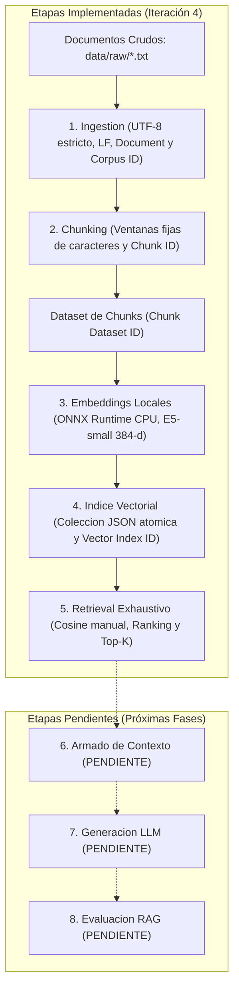
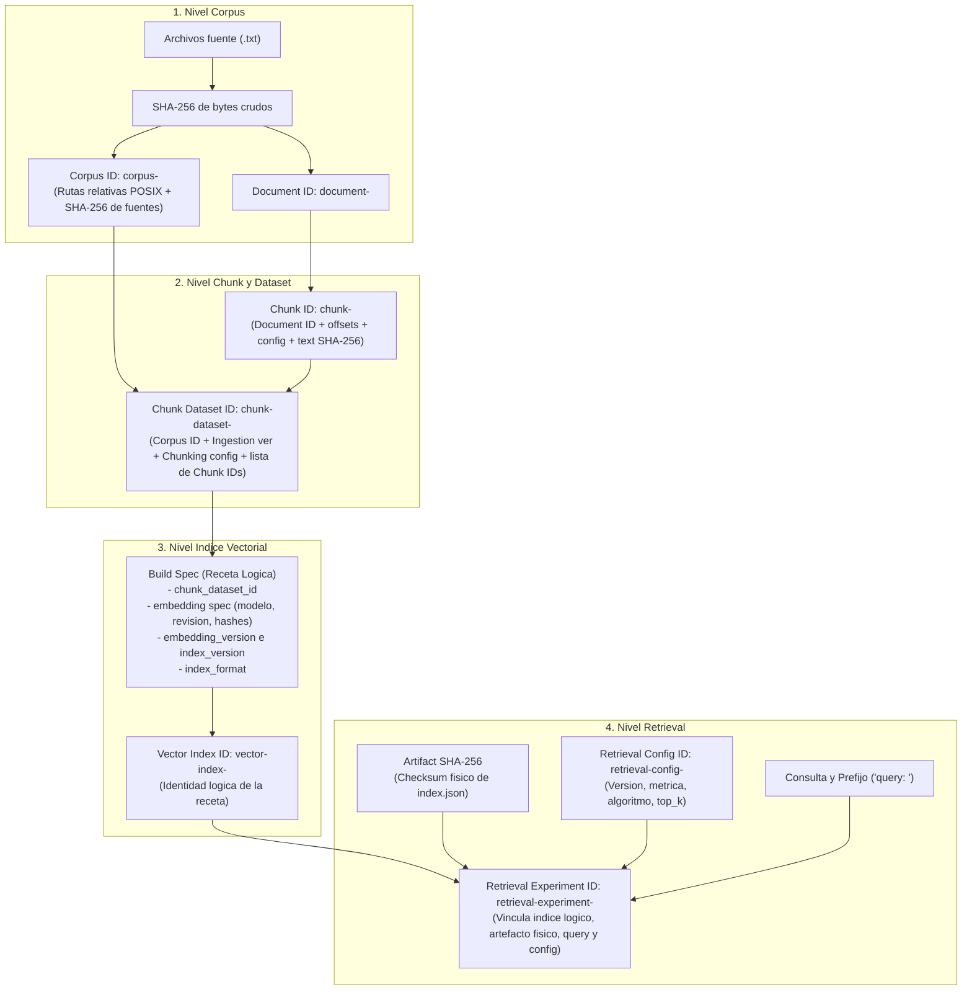
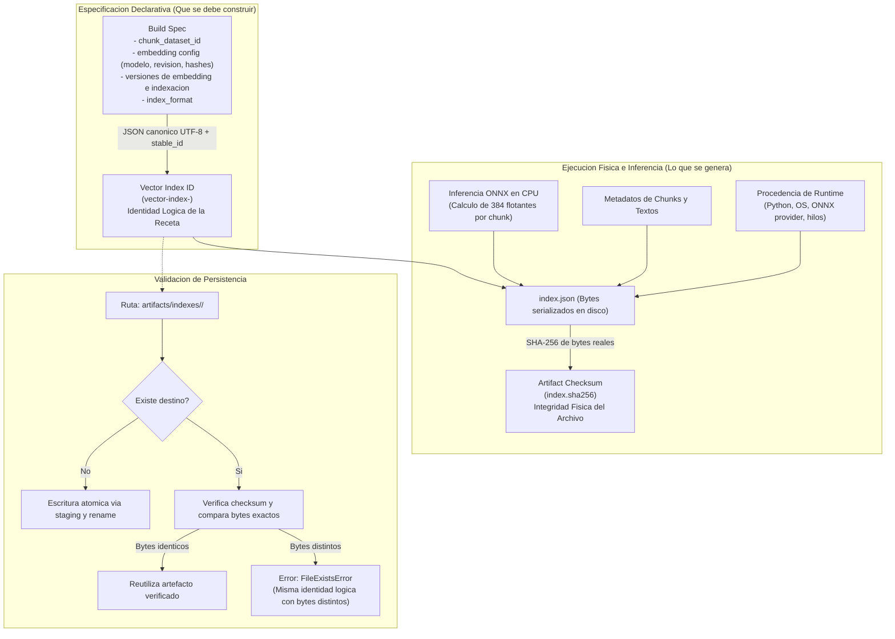
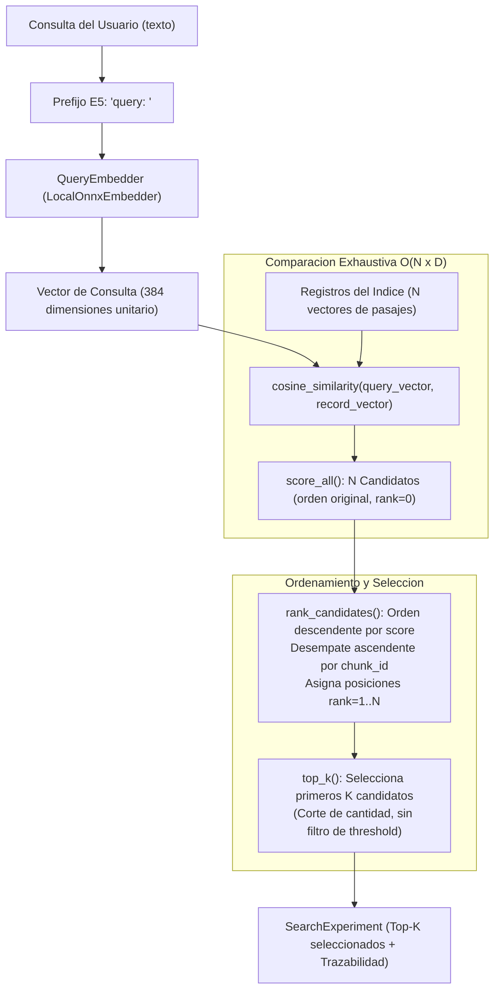

# RAG Lab: Arquitectura, Trazabilidad e Inferencia Local

Laboratorio educativo reproducible para comprender cada componente de un sistema **RAG** (*Retrieval-Augmented Generation*) desde sus fundamentos, sin dependencias de frameworks caja negra, con trazabilidad criptográfica de punta a punta e inferencia vectorial local en CPU.

**Estado actual: Cuarta iteración completada.** Se encuentran implementadas y verificadas las etapas de ingestion, chunking manual por caracteres, embeddings locales con ONNX Runtime, índice vectorial persistente en JSON con verificación de integridad y retrieval exhaustivo con cálculo manual de similitud coseno, ranking determinista y selección Top-K.

```text
[Documentos] → [Ingestion] → [Chunking] → [Embeddings] → [Índice Vectorial]
             → [Retrieval] ──(Pendiente)──> [Armado de Contexto] → [LLM] → [Respuesta] → [Evaluación]
```

---

## Qué demuestra este laboratorio (Visión para CFA)

Para un integrante del equipo o comité técnico (CFA), este laboratorio demuestra de forma tangible los principios de ingeniería detrás de RAG:

1. **Caja Blanca frente a Frameworks Opacos**: A diferencia de librerías como LangChain o LlamaIndex que ocultan la tokenización, el cálculo de similitud o la estructura del índice, aquí cada cálculo numérico, normalización y ordenamiento está escrito en código Python estándar visible e inspeccionable.
2. **Trazabilidad Criptográfica de Punta a Punta**: Cada documento, fragmento (chunk), dataset, índice y experimento de consulta posee una identidad determinista basada en SHA-256 (`stable_id`) calculada sobre JSON canónico. Es posible auditar exactamente qué documentos, configuración y pesos generaron cada resultado.
3. **Separación entre Receta Lógica y Artefacto Físico**: El laboratorio enseña a diferenciar la *identidad lógica* de un índice (su receta: datos fuente + modelo + versiones) del *checksum del artefacto físico* (los bytes exactos del archivo `index.json`, que dependen del runtime y la precisión flotante de la CPU).
4. **Privacidad Total e Inferencia Local**: No se requieren claves de API ni servicios en la nube. Los embeddings se generan en la máquina local usando el modelo cuantizado `intfloat/multilingual-e5-small` mediante **ONNX Runtime** en CPU, garantizando que los datos nunca salgan del entorno.
5. **Comprensión Crítica de Retrieval**: Se demuestra por qué un puntaje alto de similitud vectorial ($cosine$) mide proximidad de dirección geométrica pero **no garantiza relevancia semántica**, y por qué un corte Top-K sin umbral (*threshold*) siempre devuelve $K$ fragmentos aunque ninguno responda la pregunta.

---

## Alcance del Proyecto: Qué está implementado y qué NO

| Etapa | Estado | Qué está IMPLEMENTADO en el Lab | Qué NO está implementado (Próximas Fases) |
| --- | --- | --- | --- |
| **Ingestion** | Completado | Descubrimiento recursivo `.txt`/`.TXT`, decodificación UTF-8 estricta, normalización LF (`newlines_to_lf_v1`), cálculo de `source_sha256`, generación de `document_id` y `corpus_id`. | Soporte para formatos enriquecidos (PDF, DOCX, HTML), OCR, scraping web, parseo estructurado de tablas. |
| **Chunking** | Completado | Ventanas de caracteres Unicode con tamaño fijo (`chunk_size=500`) y solapamiento (`overlap=50`), cálculo de offsets `[start, end)`, SHA-256 por fragmento, generación de `chunk_id`. | Chunking recursivo por delimitadores, partición semántica por oraciones/párrafos, chunking basado en presupuesto de tokens. |
| **Dataset** | Completado | Composición inmutable de documentos ordenados y chunks resultantes, generación de `chunk_dataset_id`. | Almacenamiento en bases de datos relacionales o lakehouses. |
| **Embeddings** | Completado | Inferencia local con `intfloat/multilingual-e5-small` en ONNX Runtime CPU (384 dimensiones), prefijos `passage: ` y `query: `, mean pooling ponderado por máscara, normalización L2, validación de límite de 512 tokens. | Embeddings vía API remota (OpenAI, Cohere), aceleración por GPU (CUDA/TensorRT), fine-tuning de modelos. |
| **Índice Vectorial** | Completado | Colección serializada en JSON `rag-lab-vector-index-json-v1`, identidad lógica `vector_index_id`, persistencia atómica con `index.sha256`, prevención de colisiones y detección de corrupción. | Bases de datos vectoriales (Chroma, Qdrant, Pinecone, pgvector), índices aproximados ANN (HNSW, IVF). |
| **Retrieval** | Completado | Inferencia de consulta, cálculo exhaustivo de similitud coseno ($O(N \times D)$), ranking descendente con desempate por `chunk_id` ($O(N \log N)$), corte Top-K, registro de `retrieval_experiment_id`. | Filtrado por umbral de score (*threshold*), búsqueda híbrida (BM25 + vectores), re-ranking con Cross-Encoders, expansión de consultas. |
| **Armado de Contexto** | Pendiente | Carpeta reservada `src/rag_lab/context/` con marcador `.gitkeep`. | Plantillas de prompt, inyección de citas/metadatos, empaquetado y control de presupuesto de tokens. |
| **Generación LLM** | Pendiente | Carpeta reservada `src/rag_lab/generation/` con marcador `.gitkeep`. | Invocación de LLM (local o API), streaming de respuestas, parámetros de muestreo (temperatura, top-p). |
| **Evaluación RAG** | Pendiente | Carpeta reservada `src/rag_lab/evaluation/` con marcador `.gitkeep`. | Datasets de prueba etiquetados (ground truth), métricas de retrieval (Hit Rate, MRR, NDCG), métricas de fidelidad y respuesta. |

---

## Arquitectura del Sistema y Diagramas

### 1. Pipeline General: De Documentos a Retrieval



---

### 2. Cadena de Trazabilidad e Identidades Criptográficas

Cada objeto del sistema produce un identificador determinista `<kind>-<sha256>` calculado sobre su JSON canónico (`stable_id`):



---

### 3. Diferencia entre Identidad Lógica y Checksum del Artefacto

Una distinción arquitectónica clave de este laboratorio es que la **receta** no es lo mismo que los **bytes en disco**:

* **Identidad Lógica (`vector_index_id`)**: Se deriva exclusivamente del `build_spec` (dependencias declarativas: qué dataset, qué modelo, qué revisión fijada, qué parámetros). No depende de la hora, la ruta absoluta, la versión de NumPy ni los valores flotantes numéricos resultantes.
* **Checksum del Artefacto (`artifact_sha256` / `index.sha256`)**: Se calcula sobre los bytes exactos serializados de `index.json`. Incluye los 384 flotantes calculados por cada chunk y el bloque de procedencia de runtime (versión de Python, execution provider de ONNX, hilos de CPU).



---

### 4. Flujo de una Consulta (Retrieval)

Cómo se procesa una pregunta del usuario frente a un índice vectorial existente:



---

## Guía de Inicio Rápido para CFA

Sigue estos pasos en una terminal de **PowerShell** en Windows para reproducir el laboratorio completo desde un clon limpio.

### 1. Clonar el repositorio
```powershell
git clone https://github.com/YamiCueto/rag-example.git
cd rag-example
```

### 2. Crear el entorno virtual y configurar PYTHONPATH
El proyecto declara Python **>=3.11** (probado con **3.14.6**):
```powershell
python -m venv .venv
$env:PYTHONPATH = (Resolve-Path src).Path
```

### 3. Instalar dependencias fijadas
Instala únicamente los paquetes necesarios para la inferencia vectorial en CPU (sin frameworks RAG pesados ni PyTorch):
```powershell
.\.venv\Scripts\python.exe -m pip install --only-binary=:all: -r requirements-embeddings.lock.txt
```
*Paquetes instalados: ONNX Runtime 1.30.0, tokenizers 0.23.2, NumPy 2.5.3.*

### 4. Descargar y verificar el modelo local ONNX
Descarga el modelo cuantizado `intfloat/multilingual-e5-small` y su tokenizer directamente desde Hugging Face, verificando sus hashes SHA-256:
```powershell
.\.venv\Scripts\python.exe scripts/download_model.py
```
*Tamaño descargado: ~135 MB en la carpeta local `.models/` (ignorada por Git).*

### 5. Previsualizar la ingesta y el chunking (en memoria)
Inspecciona los documentos cargados, los offsets de fragmentación y las identidades criptográficas sin persistir nada en disco:
```powershell
.\.venv\Scripts\python.exe -m rag_lab data/raw --preview-chunks 3
```

### 6. Construir y persistir el índice vectorial
Ejecuta la inferencia sobre todos los chunks del corpus y genera el índice atómico en `artifacts/indexes/`:
```powershell
.\.venv\Scripts\python.exe -m rag_lab data/raw --build-index --preview-chunks 4
```

### 7. Ejecutar una búsqueda semántica (Retrieval)
Realiza una consulta sobre el índice existente utilizando cálculo exhaustivo de similitud coseno y ranking Top-K:
```powershell
.\.venv\Scripts\python.exe -m rag_lab search --query "¿Cómo se evita descontar inventario dos veces cuando llega el mismo evento duplicado?" --top-k 3
```

### 8. Ejecutar la suite de pruebas automatizadas
Corre los **51 tests offline** que validan la matemática vectorial, ordenamiento, contratos de identidad y persistencia atómica:
```powershell
.\.venv\Scripts\python.exe -m unittest discover -s tests -v
```

---

## Estructura del Repositorio y Dónde Consultar Cada Etapa

| Etapa / Componente | Código Fuente | Configuración | Documentación Detallada |
| --- | --- | --- | --- |
| **Ingestion** | [`src/rag_lab/ingestion/`](file:///c:/Users/YAMI/Documents/projects/rag/src/rag_lab/ingestion/) | [`config/pipeline.json`](file:///c:/Users/YAMI/Documents/projects/rag/config/pipeline.json) | Ver sección [Ingestion](#ingestion-del-archivo-al-documento) |
| **Chunking** | [`src/rag_lab/chunking/`](file:///c:/Users/YAMI/Documents/projects/rag/src/rag_lab/chunking/) | [`config/pipeline.json`](file:///c:/Users/YAMI/Documents/projects/rag/config/pipeline.json) | Ver sección [Chunking](#chunking-ventanas-visibles) |
| **Dataset e Identidades** | [`src/rag_lab/dataset.py`](file:///c:/Users/YAMI/Documents/projects/rag/src/rag_lab/dataset.py), [`src/rag_lab/identity.py`](file:///c:/Users/YAMI/Documents/projects/rag/src/rag_lab/identity.py) | N/A | Ver sección [Identidades](#identidades-fuente-frente-a-representación) |
| **Embeddings e Índice** | [`src/rag_lab/embeddings/`](file:///c:/Users/YAMI/Documents/projects/rag/src/rag_lab/embeddings/), [`src/rag_lab/indexing/`](file:///c:/Users/YAMI/Documents/projects/rag/src/rag_lab/indexing/) | [`config/embedding.json`](file:///c:/Users/YAMI/Documents/projects/rag/config/embedding.json) | [Guía de Embeddings e Índice](docs/embeddings-index.md) |
| **Retrieval y Búsqueda** | [`src/rag_lab/retrieval/`](file:///c:/Users/YAMI/Documents/projects/rag/src/rag_lab/retrieval/) | [`config/retrieval.json`](file:///c:/Users/YAMI/Documents/projects/rag/config/retrieval.json) | [Guía de Retrieval y Similitud](docs/retrieval.md) |
| **Trazabilidad y Manifest** | [`src/rag_lab/identity.py`](file:///c:/Users/YAMI/Documents/projects/rag/src/rag_lab/identity.py) | [`docs/manifest.example.json`](file:///c:/Users/YAMI/Documents/projects/rag/docs/manifest.example.json) | [Contrato Previsto del Manifest](docs/manifest.md) |

---

## Fundamentos Técnicos de las Etapas Implementadas

### Configuración y versiones

`PipelineConfig` agrupa `PipelineVersions`, `ChunkingConfig` y dos `ModelConfig`. Las dataclasses son inmutables y validan valores básicos al construirse. `load_config` lee JSON, rechaza campos desconocidos y aplica defaults a los omitidos. `to_dict()` produce la copia serializable que usará el manifest.

Las nueve capas tienen etiquetas iniciales `"1"`; no significan que todas estén implementadas. `rag_release = "0.1.0"` identifica esta receta. El chunking usa ventanas de **500 caracteres** y **50 caracteres** de solapamiento; caracteres de Python (puntos de código Unicode), no tokens, bytes ni necesariamente caracteres visuales completos. Se valida `chunk_size > 0` y `0 <= overlap < chunk_size`. Para conservar compatibilidad, el campo Python y el JSON serializado se llaman `overlap`. Al cargar JSON también se acepta `chunk_overlap`; usar ambos nombres en un mismo objeto se rechaza. La CLI ofrece `--chunk-overlap`.

El modelo real se configura en `config/embedding.json`, separado de la receta base para mantener la ejecución de ingestion/chunking sin dependencias opcionales. `PipelineConfig.embedding` conserva sus defaults `null`; si se especifican modelo o revisión allí, la CLI comprueba que coincidan con la configuración real. Generación y evaluación siguen pendientes. `RetrievalConfig`, en `config/retrieval.json`, contiene su propia versión efectiva y configuración; la operación `search` no carga `pipeline.json`.

---

### Ingestion: del archivo al documento

Ingestion descubre recursivamente archivos `.txt` (también `.TXT`) y los carga como UTF-8 estricto: un archivo inválido hace fallar la ejecución, sin reemplazar caracteres silenciosamente. Otros tipos se ignoran. `Document` conserva:

- `document_id`, ruta relativa POSIX `source_path` y `source_sha256` de los bytes originales;
- `source_text`, texto fuente intacto, y `text`, texto normalizado;
- `encoding = "utf-8"` y `normalization = "newlines_to_lf_v1"`.

La única normalización convierte `\r\n` y `\r` en `\n`. No se recortan espacios, no se altera mayúsculas/minúsculas y no se elimina BOM. Los offsets de chunks se refieren al **texto normalizado**, no a posiciones de bytes del archivo. Dos archivos con distintos saltos de línea pueden generar el mismo texto normalizado, pero conservan distintos hashes e identidades de fuente.

---

### Chunking: ventanas visibles

Chunking divide el texto en fragmentos para las etapas posteriores. Empezamos con caracteres porque las posiciones y el solapamiento son fáciles de inspeccionar. Es una decisión pedagógica aprobada, no una recomendación universal. Después podremos comparar caracteres, tokens y estrategias estructurales/semánticas.

El algoritmo comienza en `start = 0`, toma `text[start:end]`, con `end = min(start + chunk_size, len(text))`, y avanza `chunk_size - overlap`. Cuando llega al final, se detiene sin emitir un fragmento redundante de overlap. Un documento vacío produce cero chunks; uno pequeño produce un solo chunk.

```text
Texto normalizado de 1050 caracteres, tamaño 500, overlap 50:
chunk-000: [  0,  500)  500 caracteres
chunk-001: [450,  950)  500 caracteres
chunk-002: [900, 1050)  150 caracteres
```

El inicio se incluye y el final se excluye. Los caracteres `[450, 500)` aparecen tanto al final del primer chunk como al inicio del segundo: eso es overlap. Cada `Chunk` conserva documento, ID, índice desde cero, offsets, texto y SHA-256 de los bytes UTF-8 de su texto. El fixture largo de tests verifica este ejemplo; `biblioteca.txt` tiene menos de 500 caracteres y produce naturalmente un solo chunk. Se agregó `migracion_pedidos.txt`, original para este laboratorio, que sí permite ver ventanas `[0,500)`, `[450,950)`, `[900,1400)` y siguientes.

---

### Identidades: fuente frente a representación

Todos los IDs usan SHA-256 sobre JSON canónico UTF-8: claves ordenadas, sin espacios superfluos, Unicode sin escapar y sin NaN/Infinity. El objeto incluye `kind`, `schema_version = 1` y `payload`; el ID se presenta como `<kind>-<sha256>`. Los checksums de texto/archivo, en cambio, se calculan directamente sobre bytes.

| Identidad | Datos que entran en el hash |
| --- | --- |
| **Documento** | Ruta relativa POSIX y SHA-256 de los bytes fuente |
| **Corpus** | Lista de rutas relativas y hashes fuente, ordenada por ruta |
| **Chunk** | Documento, versión ingestion, normalización, versión/config chunking, índice, offsets y checksum del fragmento |
| **Dataset de chunks** | Corpus ID, versión ingestion, normalizaciones usadas, versión/config chunking y lista ordenada de chunk IDs |
| **Índice vectorial** | Dataset ID, provider/model/revision/dimensions, settings efectivos del embedding, versiones de embedding/index y formato JSON |
| **Retrieval config** | Versión de retrieval, métrica de similitud, algoritmo y valor Top-K |
| **Retrieval experiment**| Vector Index ID, Artifact SHA-256, consulta exacta, prefijo de query, especificación de embedding y Retrieval Config ID |

Mover la carpeta completa conserva las identidades: no participan rutas absolutas ni timestamps. Renombrar un archivo dentro del corpus sí cambia su identidad y la del corpus, aunque sus bytes no cambien. No se admiten rutas de documento duplicadas. Un corpus vacío tiene una identidad definida y produce cero chunks.

```text
Corpus v1                     Corpus v1
    ↓                             ↓
Ingestion v1                  Ingestion v1
    ↓                             ↓
Chunking v1 (500/50)           Chunking v2 (1000/100)
    ↓                             ↓
Chunk Dataset A               Chunk Dataset B
```

Mismo corpus, distinta representación para retrieval. Cambiar solo los parámetros ya modifica la identidad del dataset, incluso sin cambiar la etiqueta de versión. El índice depende de esa representación: cambiar el dataset cambia su identidad y exige construir los vectores derivados correspondientes.

---

### Del texto al vector

```text
Texto → Modelo de Embedding → Vector de 384 dimensiones flotantes
Corpus → Chunk Dataset → Modelo de Embedding → Índice Vectorial
```

El modelo seleccionado es **intfloat/multilingual-e5-small**, multilingüe, ejecutado en CPU mediante su export ONNX cuantizado. La receta añade `passage: ` al texto del chunk, tokeniza, ejecuta el modelo, promedia las representaciones de los tokens usando la máscara de atención (*mean pooling*) y normaliza el vector (norma L2 = 1). Estas operaciones están visibles en `src/rag_lab/embeddings/onnx_local.py`. El límite del modelo es 512 tokens; si se supera, se rechaza el chunk sin truncarlo silenciosamente.

Un embedding **no guarda significado como texto legible**. Sus dimensiones individuales normalmente no tienen interpretación humana directa; la representación numérica aprendida permite comparar la consulta con los chunks en retrieval mediante álgebra lineal.

| Cambio en el sistema | Corpus ID | Chunk Dataset ID | Vector Index ID |
| --- | --- | --- | --- |
| Contenido del archivo fuente | Cambia | Cambia | Cambia |
| Chunking 500/50 → 1000/100 | Igual | Cambia | Cambia |
| Modelo o revisión de embedding | Igual | Igual | Cambia |

Los tests de identidad usan **DeterministicTestEmbedder**, ubicado exclusivamente en `tests/`: es un **TEST DOUBLE NO SEMÁNTICO**, no un sustituto del modelo real. Consulta [embeddings e índice](docs/embeddings-index.md) para el formato de archivo, fuentes, compatibilidad y límites de reproducibilidad.

---

### Búsqueda sobre el índice existente

Con el entorno y modelo ya disponibles, la operación `search` carga y valida el índice, genera únicamente el embedding de la consulta y compara exhaustivamente todos los vectores:

```powershell
$env:PYTHONPATH = (Resolve-Path src).Path
.\.venv\Scripts\python.exe -m rag_lab search --query "¿Cómo se evita descontar inventario dos veces cuando llega el mismo evento duplicado?" --top-k 3
```

Este comando selecciona el único índice local disponible. Si tienes varios, indica `--index` con la ruta al `index.json` específico. No reconstruye el corpus ni el índice. E5 recibe `query: ` para la consulta y `passage: ` para los documentos. La CLI muestra todos los scores en el orden original del índice, el ranking completo ordenado, los Top-K seleccionados y todas las identidades criptográficas. Las vistas previas de texto se limitan a 240 caracteres, mientras `SearchResult.text` conserva el chunk completo en memoria.

Top-K selecciona los primeros $K$ del ranking: no filtra por calidad ni garantiza evidencia relevante. La [guía de retrieval](docs/retrieval.md) explica la fórmula, complejidad, compatibilidad de modelos y separación entre similitud y relevancia.

En la cuarta iteración se verificaron **51/51 tests** y se ejecutó la búsqueda oficial con E5 sobre los seis vectores existentes. El primer resultado (#1) fue el chunk 2 de `migracion_pedidos.txt`, con un score de `0.888977564`: dicho fragmento contiene exactamente la regla de idempotencia para evitar el doble descuento de inventario basada en el identificador único del evento. Esto verifica que el pipeline funciona y permite inspeccionar la evidencia de forma transparente.

---

## Límites actuales y próximas fases

Este laboratorio avanza de forma modular y verificada:
* **No hay base de datos vectorial**: el índice es un archivo JSON explícito para aprender la estructura antes de optimizar.
* **No hay búsqueda aproximada (ANN)**: la comparación es exhaustiva y lineal $O(N \times D)$.
* **No hay llamada a LLM**: no se genera texto sintético; el resultado del retrieval entrega la evidencia directa al usuario.
* **STOP**: Se revisa y valida la cuarta iteración antes de implementar el ensamblado de contexto y la integración del generador.
