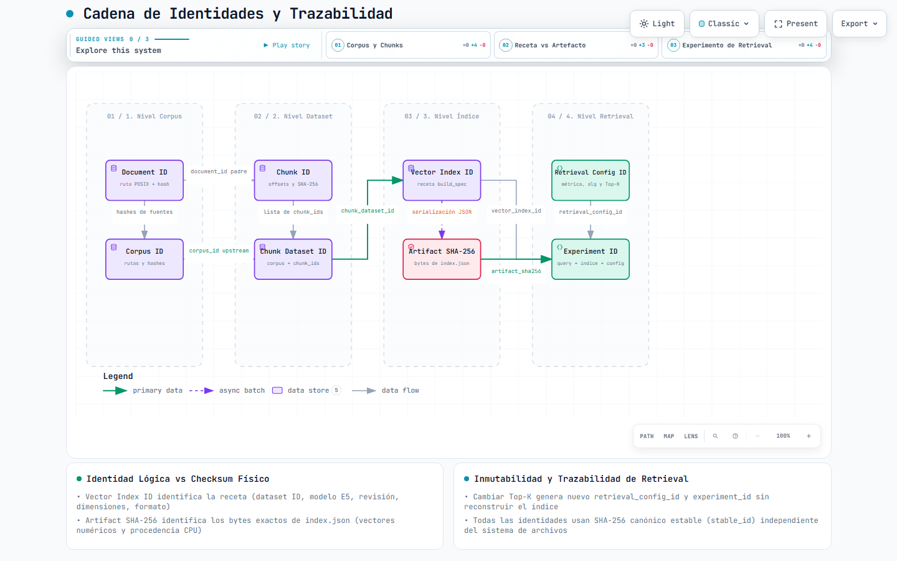
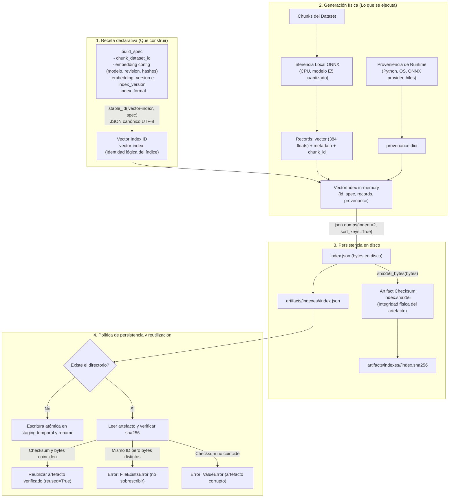

# Embeddings e índice: alcance implementado

La tercera iteración agregó la persistencia de una colección de vectores relacionada
con los chunks. La cuarta usa ese artefacto desde el módulo de
[retrieval](retrieval.md), sin reconstruirlo; todavía no genera respuestas.

## Selección y compatibilidad

Se eligió `intfloat/multilingual-e5-small`, adecuado para el corpus en español,
con 384 dimensiones. Usa el archivo oficial ONNX cuantizado
`onnx/model_qint8_avx512_vnni.onnx` y el tokenizer de la misma revisión fijada:
`614241f622f53c4eeff9890bdc4f31cfecc418b3`.

La [ficha oficial E5 de la revisión fijada](https://huggingface.co/intfloat/multilingual-e5-small/blob/614241f622f53c4eeff9890bdc4f31cfecc418b3/README.md)
especifica prefijos de entrada, mean pooling, normalización y límite de 512 tokens.
La [lista oficial de archivos](https://huggingface.co/intfloat/multilingual-e5-small/tree/614241f622f53c4eeff9890bdc4f31cfecc418b3/onnx)
publica el export seleccionado. El modelo ocupa 118346824 bytes y el tokenizer
17082730 bytes. Los SHA-256 esperados están en `config/embedding.json`.

Se comprobaron wheels e instalación de ONNX Runtime 1.30.0 y NumPy 2.5.3 para
CPython 3.14 Windows x64, y tokenizers 0.23.2 con ABI estable compatible.
[PyPI ONNX Runtime](https://pypi.org/project/onnxruntime/1.30.0/) publica esa wheel.
`pip check` pasó, y una inferencia corta real produjo 384 valores en **Python 3.14.6,
Windows 11, CPUExecutionProvider**. El nombre del export contiene `avx512_vnni`;
la compatibilidad observada es con este equipo, no una garantía para toda CPU.
No se instaló Torch, sentence-transformers ni transformers.

`requirements-embeddings.lock.txt` fija las versiones instaladas, incluidas
transitivas de tokenizers/Hugging Face y ONNX Runtime. Solo los tres paquetes
directos se importan en el adaptador. La inferencia no usa servicios remotos;
la descarga inicial de assets se ejecuta explícitamente y por separado.

## Contrato y algoritmo

`EmbeddingSpec` expone `provider`, `model`, `revision`, `dimensions` y `settings`.
`Embedder` es un protocolo pequeño: esa especificación, procedencia de runtime y
`embed(text)`. No es una capa de orquestación. `LocalOnnxEmbedder` implementa:

1. Verificación de checksums del modelo y tokenizer locales.
2. Prefijo `passage: ` y tokenización con el tokenizer fijado.
3. Rechazo si el texto requiere más de 512 tokens, incluidos tokens especiales.
4. Inferencia de un chunk por vez en CPU, con un hilo de ejecución.
5. Mean pooling ponderado por la máscara de atención.
6. Normalización L2 del vector; rechazo de resultados nulos/no finitos.

La cuarta iteración agrega `QueryEmbedder` y `embed_query(text)`: comparte el
procesamiento anterior y cambia el prefijo de entrada a `query: `. Los vectores
de documentos existentes conservan `passage: ` y sus bytes originales.

La política de prefijo, límite, rechazo, precisión, pooling y normalización forma
parte de la identidad. El adaptador solo acepta la receta E5 implementada;
cambiar arbitrariamente un nombre de modelo en JSON no implementa ese modelo.
El contrato permitirá agregar otro adaptador cuando se autorice un experimento.

`DeterministicTestEmbedder` vive en `tests/test_embedder.py`, usa hashes para
producir números repetibles y declara `provider=test-double`. **No representa
semántica ni demuestra calidad del modelo real.**

## Formato local y dependencia lógica

[](architecture/identities.html)

> [!TIP]
> Puedes explorar este esquema de forma interactiva en **[identities.html](architecture/identities.html)** para inspeccionar la separación entre la identidad lógica de la receta (`vector_index_id`) y la integridad física (`artifact_sha256`). Para el contexto de extremo a extremo, consulta el **[pipeline general](architecture/pipeline.html)** o el [catálogo de arquitectura](architecture/README.md).

```text
artifacts/indexes/<vector_index_id>/
├── index.json
└── index.sha256
```

`index.json` contiene:

- `vector_index_id`: `vector-index-` + SHA-256 del build spec mediante el contrato
  de JSON canónico de `identity.py` (kind + schema_version + payload).
- `build_spec`: `chunk_dataset_id`, configuración completa de embedding,
  `embedding_version`, `index_version` e `index_format=rag-lab-vector-index-json-v1`.
- `records`: colección ordenada, un registro por chunk. Cada registro contiene
  `chunk_id`, `embedding` (incluye modelo/revisión/dimensiones), `vector` y
  `metadata` (documento, ID del chunk, índice, offsets, texto, checksum de texto).
- `provenance`: corpus ID, Python, plataforma, versiones de librerías, execution
  provider y número de hilos.

El índice lógico depende del dataset, incluyendo transitivamente corpus y chunking,
y de la configuración real de embeddings, incluyendo hashes de assets.
Su ID no depende de fecha, ruta absoluta, vectores producidos ni versión del runtime.
El checksum **sí** depende de todos los bytes, incluidos los vectores y runtime.
La serialización de archivo usa JSON UTF-8 legible, claves ordenadas y nueva línea
final; rechaza NaN e Infinity. No usa exactamente los bytes compactos del ID lógico.



La construcción valida dimensión, números finitos y ausencia de chunk IDs
duplicados. Como la inferencia se invoca por chunk, se conserva su orden y relación.
El formato es deliberadamente redundante para poder inspeccionar un registro solo.

## Persistencia y límites

Los archivos se escriben primero en un directorio temporal del mismo filesystem,
se sincronizan y se publica el directorio completo mediante rename. Un destino
existente solo se reutiliza cuando checksum y bytes coinciden. Ante corrupción,
contenido distinto o un destino incompleto, se falla sin sobrescribir.

La comparación es conservadora: un cambio de runtime puede producir bytes distintos
incluso con vectores iguales. En ese caso se rechaza reutilizar la misma ruta lógica;
se puede elegir otro directorio de artifacts para investigar, sin borrar el anterior.
Igualdad de receta no promete igualdad numérica universal entre hardware/librerías.

Esto es trazabilidad parcial verificable, no todavía un manifest integral:
no hay snapshot automático de código, ni manifest de todas las etapas, ni archivo
independiente del dataset de chunks. Se deben conservar corpus, configuración,
assets y código; los hashes por sí solos no reconstruyen archivos perdidos.
Cuando cambie la implementación, hay que incrementar sus versiones explícitas.

Los tests offline cubren identidades y persistencia con el test double. La ejecución
real de embeddings de la tercera iteración comprueba funcionamiento local, no
evalúa calidad semántica. La búsqueda real de la cuarta se verifica por separado.
