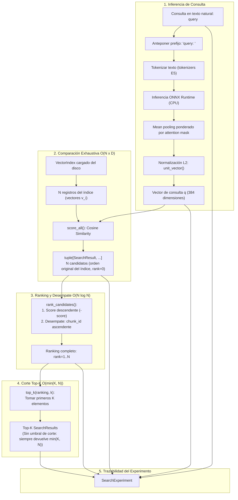
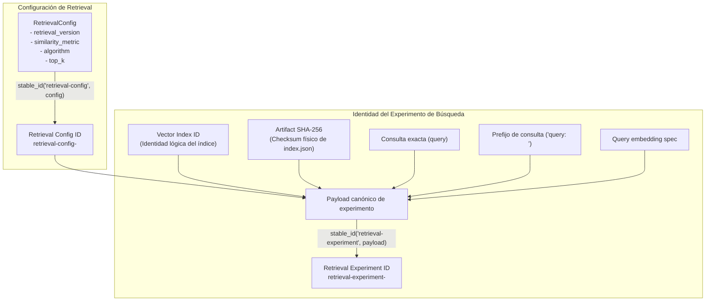

# Retrieval: de una pregunta a evidencia candidata

La cuarta iteración recupera chunks del índice JSON existente. Cada paso está
visible en `src/rag_lab/retrieval/__init__.py`:

```text
Consulta → Query embedding → Score de todos los chunks → Ranking → Top-K
```

## Query embedding y compatibilidad E5

El query embedding representa la pregunta como un vector de 384 números. Se genera
localmente con `LocalOnnxEmbedder.embed_query()`, usando el modelo ONNX y tokenizer
ya instalados. No vuelve a generar embeddings de documentos.

La [ficha oficial de intfloat/multilingual-e5-small, revisión fijada](https://huggingface.co/intfloat/multilingual-e5-small/blob/614241f622f53c4eeff9890bdc4f31cfecc418b3/README.md)
indica usar `query: ` para consultas y `passage: ` para pasajes en retrieval,
también con textos en español. La revisión es
`614241f622f53c4eeff9890bdc4f31cfecc418b3`. Los prefijos incluyen un espacio final:
se anteponen al texto antes de tokenizar, sin modificar el texto del corpus.

Consulta y documentos comparten modelo, revisión, tokenizer, pooling y
normalización. Tener igual dimensión no basta para compartir espacio vectorial.
La CLI y `search()` comparan la especificación completa con la del índice:
provider, model, revision, dimensions y settings (incluidos hashes de assets).
El adaptador verifica los archivos locales y aplica el prefijo de consulta
separadamente del `input_prefix = "passage: "` almacenado en la receta del índice.
Se rechaza una pregunta vacía o una entrada que supere 512 tokens; no se trunca.

## Cosine similarity manual

Para la consulta q y el vector v de un chunk, ambos de D dimensiones:

```text
cosine(q, v) = Σ(qᵢ × vᵢ) / (√Σqᵢ² × √Σvᵢ²), i = 1 … D
```

Compara la dirección de los vectores. El resultado está entre -1 y 1; vectores
idénticos no nulos dan 1 y vectores ortogonales dan 0. No es una probabilidad de
que el chunk responda correctamente.

`cosine_similarity()` valida dimensiones iguales y normaliza ambos vectores
antes de calcular el producto escalar. Aunque E5 ya aplica normalización L2,
la función funciona también con vectores no normalizados. Rechaza vacíos, norma
cero y valores no finitos o no numéricos; escala antes de normalizar para evitar
desbordamiento y limita pequeños errores de redondeo al intervalo [-1, 1].

## Búsqueda exhaustiva, ranking y Top-K



1. `score_all()` recorre cada vector del índice y conserva su score y metadata.
   Estos candidatos mantienen el orden del índice y tienen `rank=0`.
2. `rank_candidates()` ordena por score descendente; empates exactos se resuelven
   por `chunk_id` ascendente. Asigna posiciones desde 1.
3. `top_k()` toma los primeros K del ranking, sin recalcular scores.

Para N vectores de D dimensiones, calcular todas las similitudes cuesta
**O(N × D)**. Ordenar todos los candidatos cuesta **O(N log N)**. El corte final
cuesta O(min(K, N)); el conjunto de comparación y ranking cuesta
**O(N × D + N log N)**. Esto no incluye cargar el archivo ni inferir el embedding
de la consulta. Los vectores cargados ocupan O(N × D), además del texto/metadata;
candidatos y ranking requieren O(N) referencias/registros adicionales.

Todavía usamos una colección JSON para enseñar cada comparación antes de introducir
una base vectorial. Al crecer el corpus, cargar todos los vectores en memoria y
compararlos en cada consulta aumenta el consumo de memoria y el tiempo de búsqueda.
Esta limitación motivará estudiar otras estructuras; no se implementa ANN aquí.

K debe ser un entero positivo. Si hay menos de K candidatos, se devuelven todos;
un índice vacío produce cero resultados. **Top-K no equivale a un threshold**:
elige una cantidad, no exige un score mínimo. Con N ≥ K, una pregunta sin evidencia
relevante también devuelve K resultados. Siempre existen primeros lugares aunque
todos los fragmentos sean inútiles para responder.

## Trazabilidad y configuración

`SearchResult` conserva `rank`, `score`, `chunk_id`, `document_id`, `chunk_index`,
`start_char`, `end_char` y `text` completo. Los offsets `[start_char, end_char)`
son puntos de código Unicode del documento normalizado: incluyen inicio y excluyen
final. El ID del documento permite vincularlo al corpus; el resultado no incluye
una ruta de archivo. El checksum del texto sigue disponible en el registro del
índice, aunque no se duplica en `SearchResult`.

`config/retrieval.json` define una dataclass inmutable `RetrievalConfig`:

```json
{
  "retrieval_version": "1",
  "similarity_metric": "cosine",
  "algorithm": "exhaustive",
  "top_k": 3
}
```

Solo esos algoritmo y métrica están implementados. `search` carga esta receta
independiente; no lee la etiqueta retrieval de `pipeline.json`. Cambiar el
comportamiento de retrieval exige actualizar explícitamente `retrieval_version`.
`--top-k` cambia la configuración efectiva en memoria, sin editar el JSON.

`SearchExperiment` conserva consulta original, prefijo, configuración efectiva,
especificación del embedding, runtime de consulta, índice ID/checksum y las tres
colecciones: candidatos, ranking completo y seleccionados.

| Identidad | Dependencias |
| --- | --- |
| `retrieval_config_id` | Versión, métrica, algoritmo y Top-K efectivos |
| `retrieval_experiment_id` | Índice ID, artifact SHA-256, consulta exacta, prefijo, especificación del embedding y retrieval config ID |



Los IDs usan `stable_id()`: SHA-256 de JSON canónico con tipo y versión de esquema.
Cambiar K o consulta cambia el experimento, sin invalidar ni reconstruir el índice.
El runtime se conserva en memoria pero no participa en este ID; tampoco los scores.
El ID identifica entradas/configuración, no garantiza scores idénticos entre
equipos. La CLI imprime IDs y resultados, pero no persiste un manifest ni el
objeto completo: el [manifest integral](manifest.md) sigue pendiente.

## Uso de la CLI y lectura del resultado

El [README](../README.md#búsqueda-sobre-el-índice-existente) contiene el comando de
la consulta oficial. `--index` señala un `index.json` existente; si se omite,
la CLI requiere exactamente un índice en `artifacts/indexes/*/index.json`.
`--retrieval-config`, `--embedding-config` y `--model-directory` permiten seleccionar
los archivos locales. Esta operación no descarga ni construye artefactos.

`load_index()` verifica el SHA-256 contra `index.sha256`, recalcula la identidad
del build spec y valida formato, vectores y metadatos. La identidad y checksum
esperados para el cierre también se comprueban contra el registro previo: un
checksum lateral coherente por sí solo no demuestra que sea el artefacto esperado.
Si no coincide, hay que detenerse sin sobrescribir ni reconstruir.

La salida separa todos los scores en orden de índice, ranking completo y Top-K.
Imprime scores con nueve decimales; ordena usando la precisión interna, no el
texto redondeado. Para cada seleccionado muestra documento ID, chunk ID, índice,
offsets y una vista previa de los primeros 240 caracteres escapada como JSON.
Para inspeccionar toda la evidencia se lee el texto completo del registro del
índice, sin ejecutar de nuevo la consulta.

**Similitud vectorial** es el score calculado. **Relevancia real de la evidencia**
requiere leer el texto y comprobar si contiene lo necesario para contestar.
Un chunk sobre inventario puede estar cerca de la pregunta sin explicar el control
de duplicados; otro puede contener el mecanismo concreto. También hay que revisar
frases cortadas por los offsets y repetidas por el overlap. Un score alto por sí
solo no demuestra que el Top-3 sea suficiente o correcto.

Los tests offline comprueban matemática, orden, Top-K, compatibilidad, identidades
e integridad con datos controlados. La consulta oficial con E5 verifica por separado
la CLI y la inferencia real. Ninguna de estas verificaciones constituye todavía
una evaluación de calidad RAG con preguntas etiquetadas o métricas.

**STOP:** no se agregan threshold, ANN/HNSW, base vectorial, reranking, búsqueda
híbrida, armado de contexto, LLM ni evaluación RAG en esta iteración.
